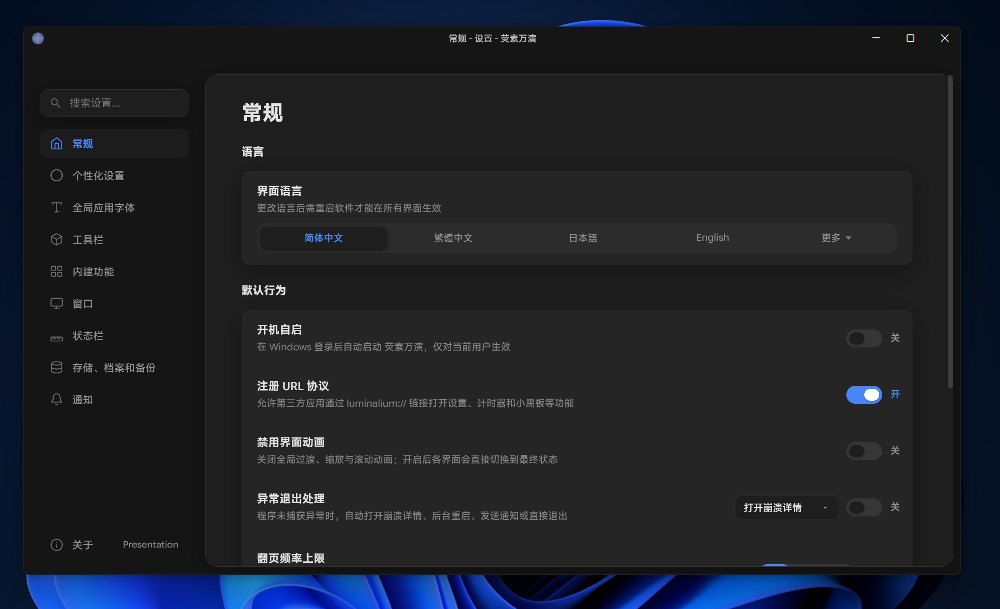
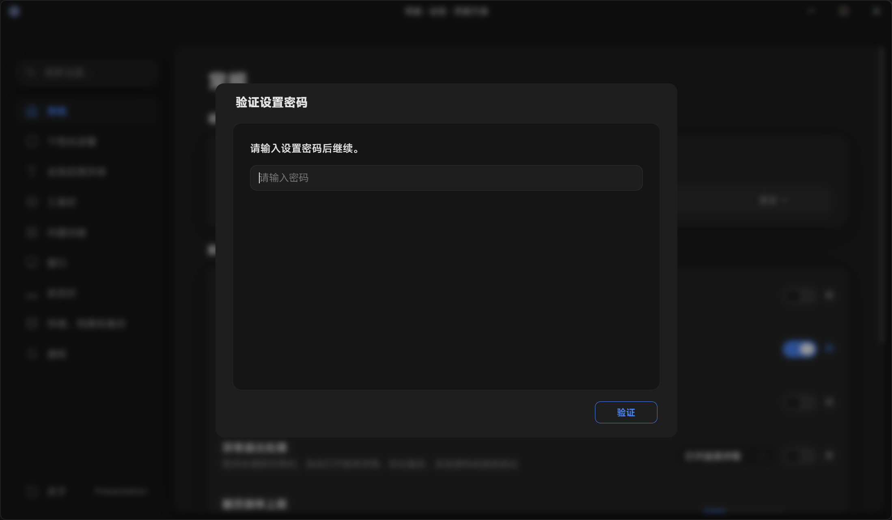
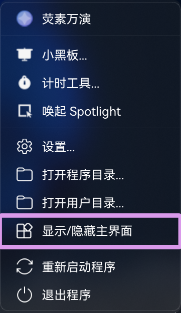

# 常规设置

这是“常规”设置页面的截图。

## 默认行为
### 开机自启
如您启用此选项，荧素万演将在您登录用户账户后自动启动，对当前用户生效。关闭则否。
### 注册 Uri 导航
如您启用此选项，荧素万演将响应 Uri 导航，例如：`luminalium://intergrate/timer`。关闭则否。
下表是 Uri 导航及其对应的页面：
| Uri 导航 | 页面 |
| --- | --- |
| `luminalium://app/settings/general` | 常规设置页面 |
| `luminalium://app/settings/theme` | 个性化设置页面 |
| `luminalium://app/settings/fonts` | 字体设置页面 |
| `luminalium://app/settings/plugins` | 工具栏设置页面 |
| `luminalium://app/settings/window` | 窗口设置页面 |
| `luminalium://app/settings/about` | 关于页面 |
| `luminalium://intergrate/timer` | 定时器页面 |
| `luminalium://intergrate/board` | 黑板页面 |
### 禁用界面动画
顾名思义，禁用后，软件将不会进行任何界面动画。此设置项可一定程度上缓解低性能设备上的运行效率，若您的性能不足以支持运行荧素万演，此项估计不会起太大作用。
### 异常退出处理
若您在教学场景或生产环境下使用荧素万演，启用此项可防止软件在崩溃时打扰正常的事件流程。

此项启用后分为三者情况，下表是会执行的行为。
| 选项 | 行为 |
| --- | --- |
| 立即退出应用 | 立即退出，需要手动重启或在下一次登录操作系统后自动启动（需要启用[开机自启](#开机自启)）。 |
| 后台重启（不显示启动画面） | 软件将在后台重启。 |
| 退出且发送 Windows 通知 | 退出软件并发送 Windows 通知，软件退出而不会自动重启。 |

### 翻页频率上限
此项可设置一段时间内最大接收并处理翻页信号的次数。
如您的设备性能羸弱，建议将此值设置为较低的数值，防止出现等设备恢复响应后出现无法控制地疯狂翻页的情况。

## 安全
### 设置密码保护
如您启用此选项，荧素万演将在您启用设置时要求您输入设置的密码。
此项用于防止教室里面的闲得发慌的学生乱改您的设置。

这是要求您输入密码的截图。

## 兼容性
### 兼容模式
如您启用此选项，荧素万演将禁用批注相关功能，同时页码获取将不会生效。

另外，顶层窗口的页面显隐状态需要您手动在主菜单中切换。

---

以上是常规设置的全部内容。