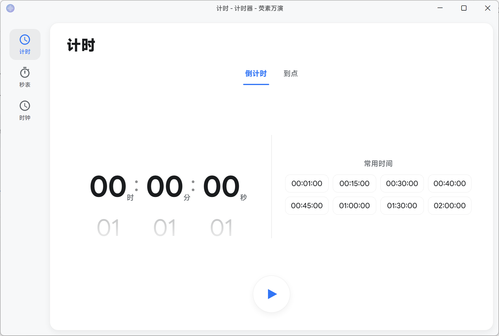
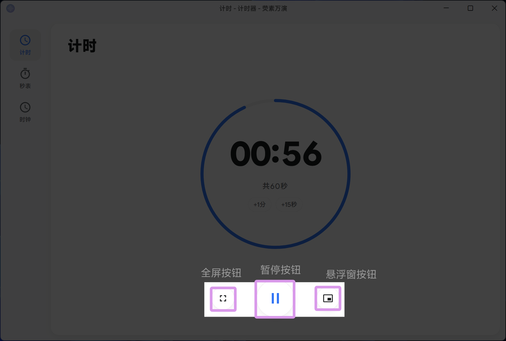
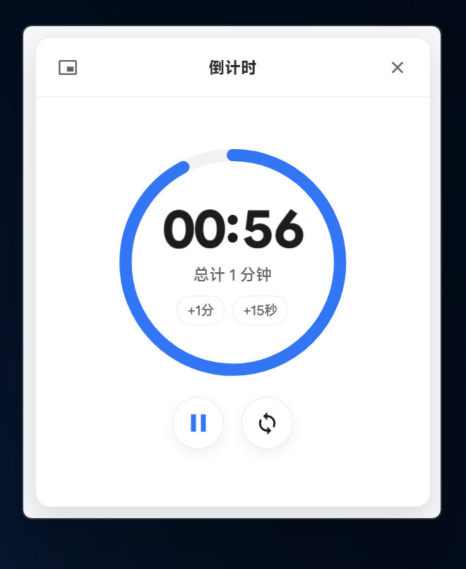
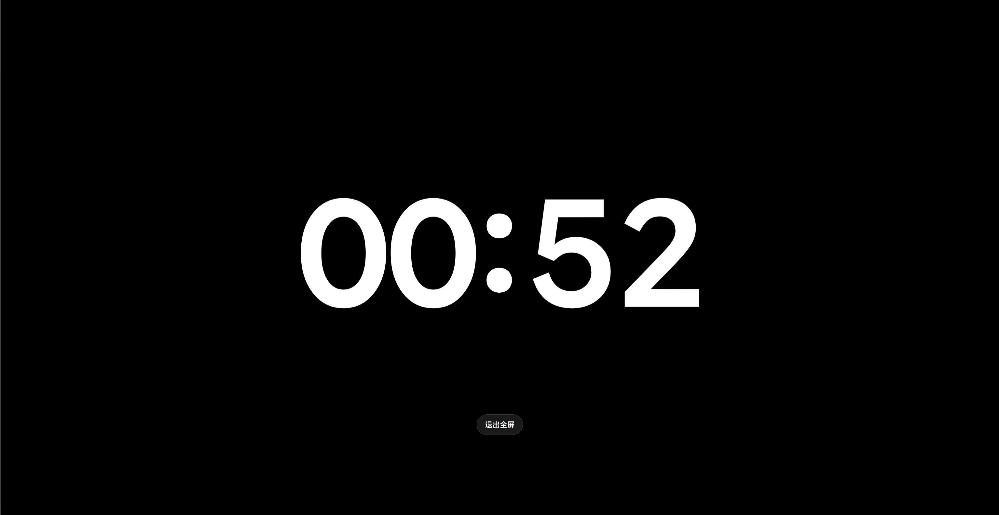

# 计时器



这是计时器的截图。
## 启动计时器
若要启动计时器，请点击主菜单中的 "计时器" 选项。
您亦可在放映时点击 "计时器" 按钮来启动计时器。

或者，您也可使用 Uri 链接启动计时器。
Uri 链接格式为：
```
luminalium://intergrate/timer
```

## 调谐计时器倒计时
### 定时
若要调谐计时器的倒计时时间，请将 Pivot 切换到“倒计时”选项卡。
在其界面左侧滑动轮盘可自定义时间，点击右侧预设常用时间可快速拨时。

### 到点
若要调谐计时器的倒计时到点时间，请将 Pivot 切换到“到点”选项卡。
您需要将轮盘拨到今日还未到的时间，否则目标时间将会自动拨至明天同时。


## 切换到小窗或切换全屏



若要切换到小窗或切换全屏，请点击正在计时器计时界面的 "小窗" 或 "全屏" 按钮。
“全屏”按钮可切换到全屏模式，而“小窗”按钮则可切换到小窗模式，其分别位于暂停按钮的左右两侧。


### 小窗模式
小窗模式下，计时器会默认显示在屏幕的右上角。
拖动“倒计时”字样可拖移计时器窗口到其他位置。



小窗的顶栏分为两个部分：
- 左侧为恢复按钮。
- 右侧为关闭窗口按钮。

### 全屏模式
全屏模式下，计时器会占满整个屏幕。
倒计时数字下方有”退出全屏“按钮。点击该按钮可退出全屏模式。



若要调整全屏模式，请在 ”设置“ -> ”内建功能“ -> “计时器全屏行为“ 中进行调整。

如您使用 1.3.11.0 及之前的版本，您可能无法找到”内建功能“选项卡，您需要在”窗口“设置选项卡中进行调整。

