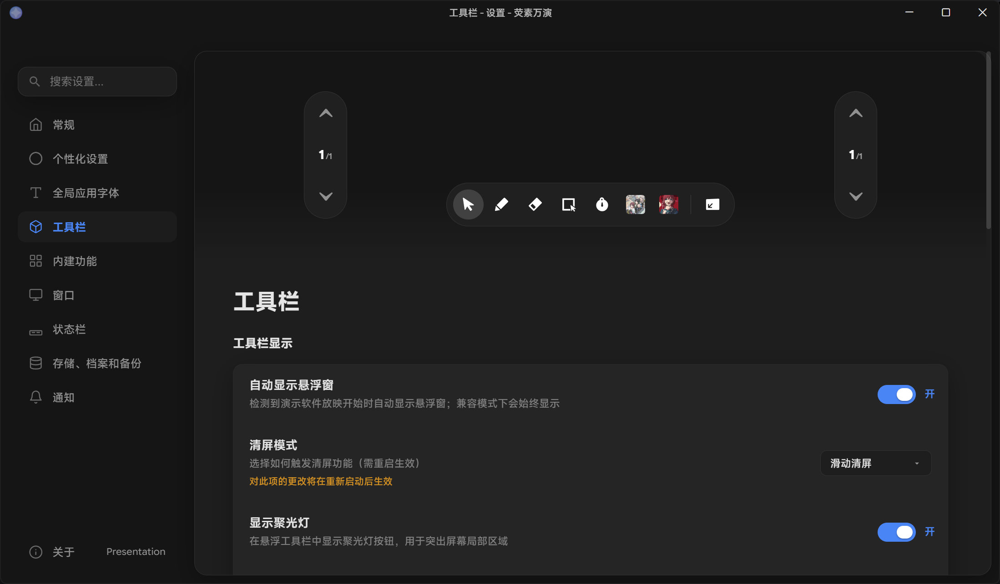

# 工具栏

这是工具栏设置的截图。  

## 工具栏显示
### 自动显示悬浮窗
检测到演示软件进入幻灯片放映演示时，荧素万演将自动显示悬浮窗。
若您启用了兼容模式，此选项将无效。您需要关闭“兼容模式”才能使用此选项，若要关闭此选项，请参阅[常规设置](general-settings.md)。

### 清屏模式
此项用于控制在当前工具为橡皮下再点击一次橡皮弹出的清屏菜单样式，可选二种。
· 滑动清屏
· 按钮清屏
前者弹出滑块样式，后者弹出按钮样式。

### 显示聚光灯·板中板·计时器
这三个选项用于控制是否在工具栏中显示内建的聚光灯、板中板、计时器的入口。
如您有自定义的组件而不需使用内建的组件，建议您关闭这些选项。在“工具栏固定项”中自定义您自己的组件的快捷方式可能会更适合您。

### 工具栏自动半收起
如您启用此选项，荧素万演将在您长时不操作工具栏时自动半收起工具栏。
将鼠标悬停或是触屏点击已经处于半收起状态的工具栏，即可恢复工具栏。

### 工具栏·两侧翻页组件透明度
此项用于控制工具栏或两侧的翻页组件的透明度。
您可分别调节。不过，如您启用了“同步两侧翻页栏透明度调节”选项，两侧翻页栏的透明度将同步调节至与工具栏透明度统一。

### 工具栏固定项
您可在“工具栏固定项”中自定义快捷方式/应用程序/视频/图片/音频等其他文件。
同时，您也可以自行重命名他们在工具栏中的显示名称。