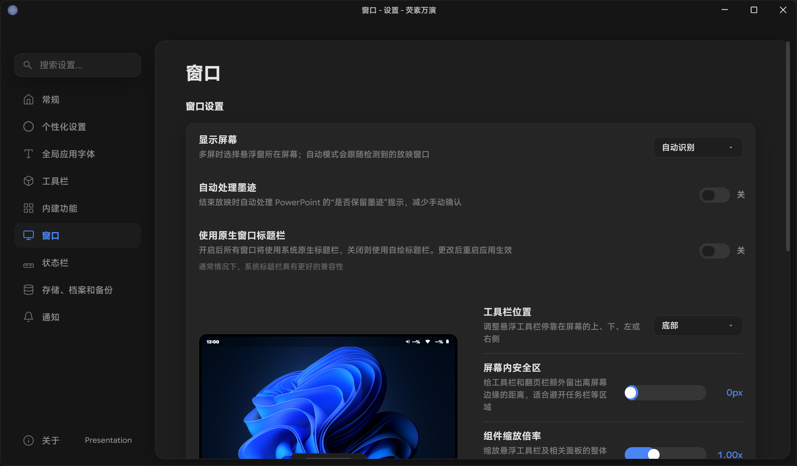
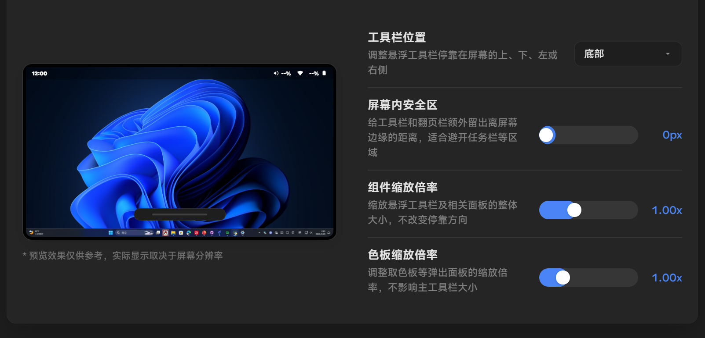

# 窗口设置

这是窗口设置界面的截图。

## 窗口设置
### 显示屏幕
如您使用的是多屏幕，您可以选择荧素万演的顶层窗口显示在哪个屏幕上。
如您选择“自动选择”，荧素万演将会把顶层窗口显示在非演示者视图的屏幕上。

### 自动处理墨迹
启用此选项后，荧素万演将在您尝试执行退出放映时接管 PowerPoint 的询问，关闭则使用 PowerPoint 的原版询问。
不推荐使用此选项，可能会在生产环境造成一些困扰。

### 使用原生窗口标题栏
启用此选项后，荧素万演的使用 WebEngine 的窗口将使用原生的标题栏，而不是自定义的标题栏。
如您的操作系统对自绘窗口标题栏兼容性不佳，建议您启用此选项。

通常情况下，原生窗口标题栏会具有更好的兼容性。

### 窗口调节

荧素万演的设置提供了一个可视化的界面用于预览您调节的效果。

您可以自由调节屏幕内安全区、组件缩放倍率和色板缩放倍率。
推荐在调节组件缩放倍率的同时调节色板缩放倍率，以保持一致的效果。

## 顶层窗口
### 严格贴边对齐
移除贴边时的额外预留，让工具栏和翻页栏更紧贴屏幕边缘。

### UIAccess 置顶
使用 UIAccess 权限将悬浮窗置顶于所有窗口之上，包括系统级窗口；需以管理员身份运行才可生效。

### 允许录屏捕获
启用后，将调整窗口属性以便被录屏软件录制。这会导致悬浮窗显示在任务栏中且只会在一个虚拟桌面上显示，如您没有录制窗口的需求，请勿开启此选项。

### 窗口层级检测频率
设置检测悬浮窗 Z 序（层级关系）并强制置顶的轮询间隔，值越小响应越快但 CPU 占用越高。
不推荐使用 50ms 这一选项，因为这会导致极高的性能资源占用，从而影响幻灯片放映的性能。