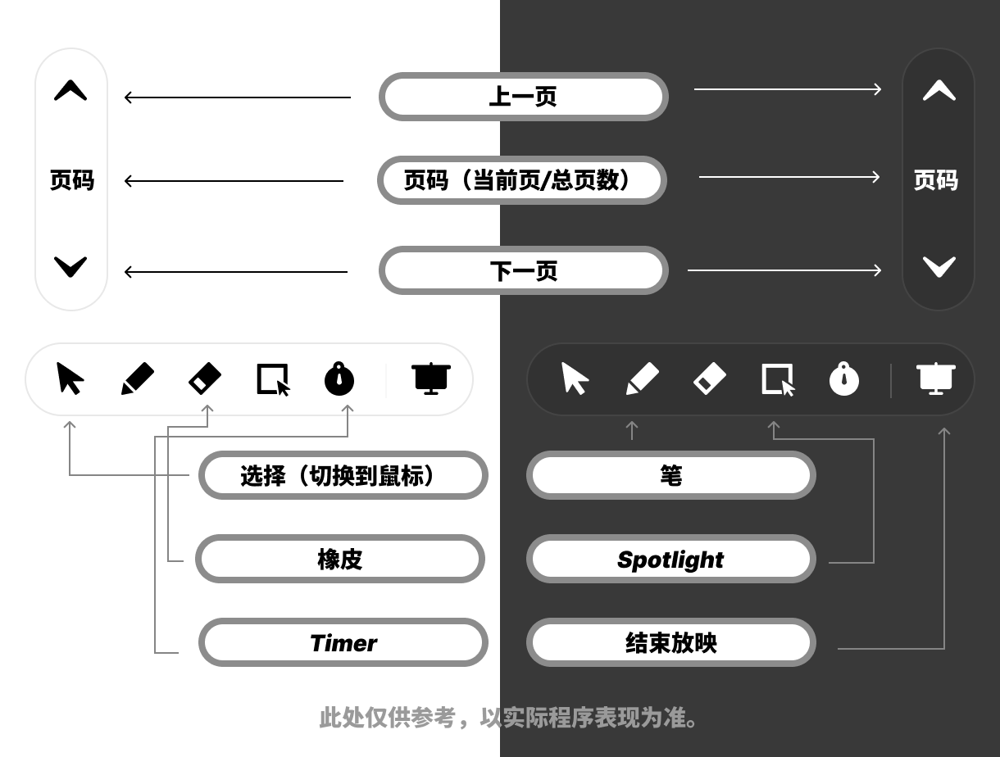

# Overlay Window

以上是覆盖窗口的示意图。

## 功能详解

|功能|描述|
|-|-|
|上一页|切换到上一页|
|下一页|切换到下一页|
|页码显示区（当前/总共）|显示当前页码和总页数|
|选择（切换到鼠标）|切换到鼠标指针|
|笔|绘制（使用 Office PowerPoint 的接口）|
|橡皮|擦除|
|聚光灯|打开 Spotlight，详见 Spotlight|
|计时器|打开 Timer，详见 Timer|
|清屏|清除所有绘制内容|
|自定义启动台区（如有）|自定义启动台区域，详见设置中的“自定义工具栏”|
|退出放映|退出正在进行的放映|

