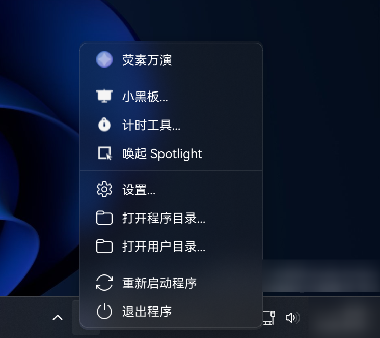
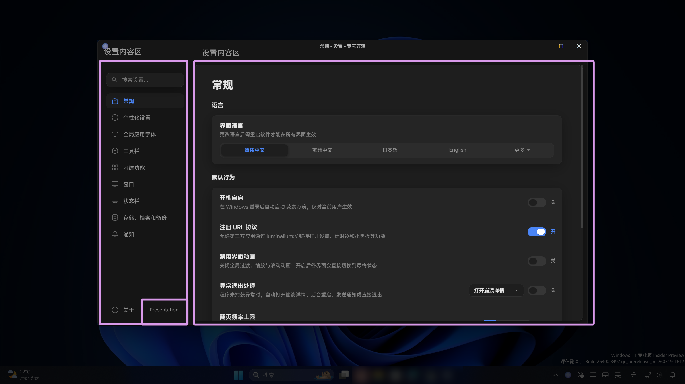
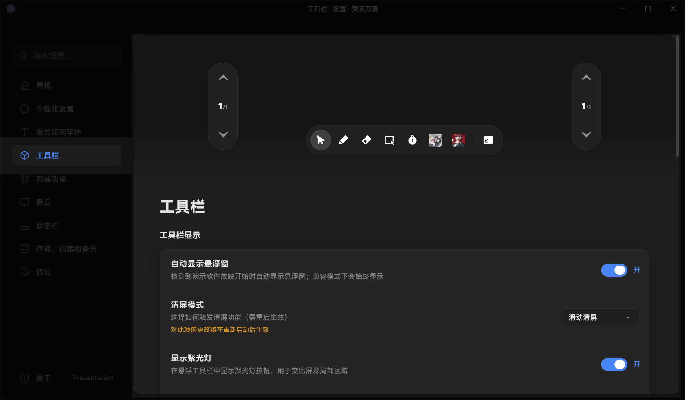

# 概念性导向

本页介绍荧素万演的概念性导向和基本的使用方法。

## 结束向导后
您可能注意到了，当您完成应用向导以后，您的系统托盘会多出一个托盘图标。

此图标是启动主菜单的入口，如您没有看见此图标，请重启程序。

## 主菜单

何为主菜单？顾其名即可思其义，它是程序功能的总入口。

通过主菜单，您可以打开自带的计时器、小黑板和聚光灯等内建功能；抑或是进入程序或用户目录。

当然，通过主菜单，您可以方便的退出程序和重新启动程序以应对突发情况。
> 如您设置了开机启动，那么通过托盘退出的程序将在下次启动系统时自动启动。

## 设置和编辑主界面

“设置”涵盖了程序全部的设置项目，设置如图示的几个部分组成。

若要编辑主界面，请点击侧边栏上的“工具栏”。

