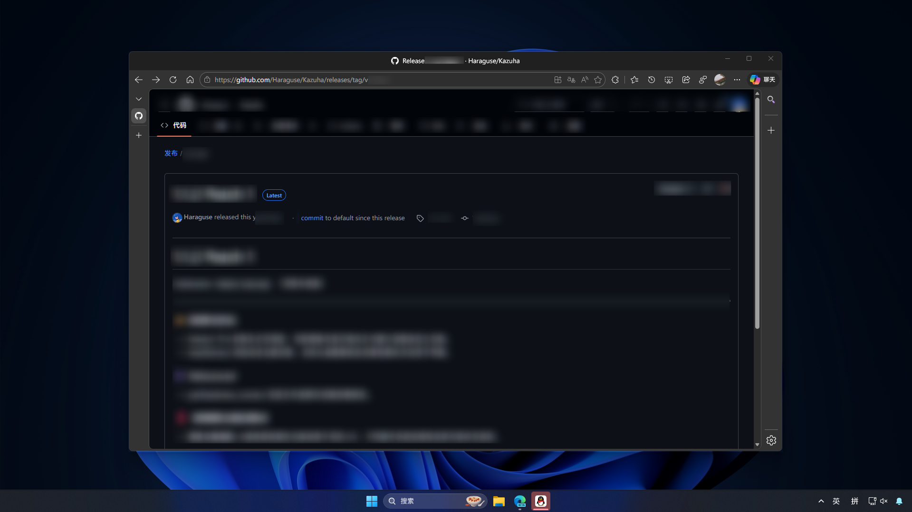
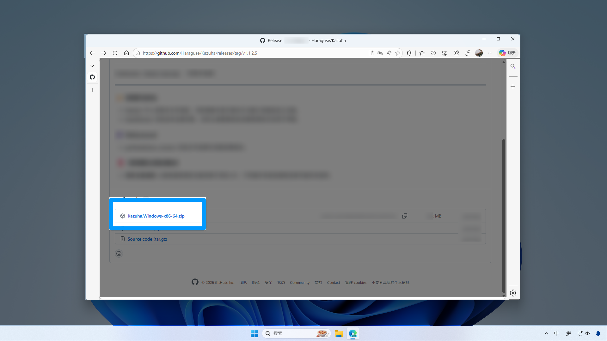
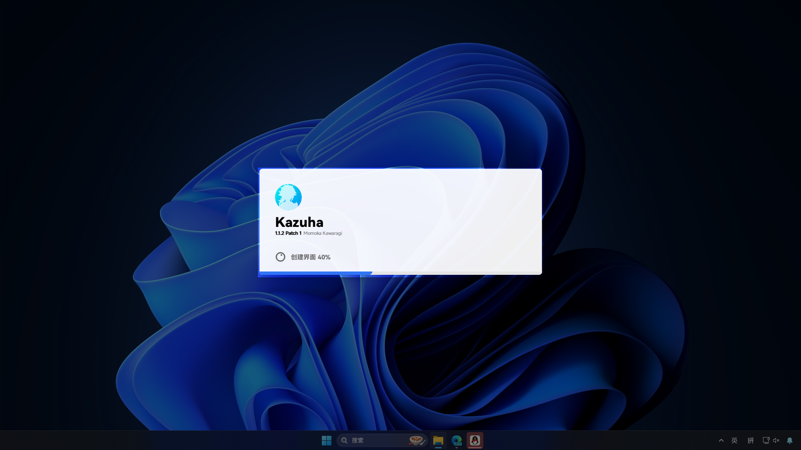

# 下载与安装

## 下载

1. 打开 [Kazuha 发布页](https://github.com/Haraguse/Kazuha/releases)。

   

2. 在最新版本中找到安装包，点击下载。

   

3. 下载完成后，安装包会出现在“下载”文件夹。  
   为避免文件混乱，建议将其解压到独立文件夹。

::: warning 注意
如果连“解压”都不熟悉，请先学习相关基础操作，再继续阅读。
:::

## 安装与启动

1. 解压后，双击 `Kazuha.exe` 启动程序。  
   正常情况会看到如下启动界面：

   <!-- 启动界面截图占位 -->

2. 如需个性化设置，右键任务栏右下角的托盘图标即可。

   

---

总之，安装就是这么简单，如您想要进行进一步操作，请参阅往后的内容。
