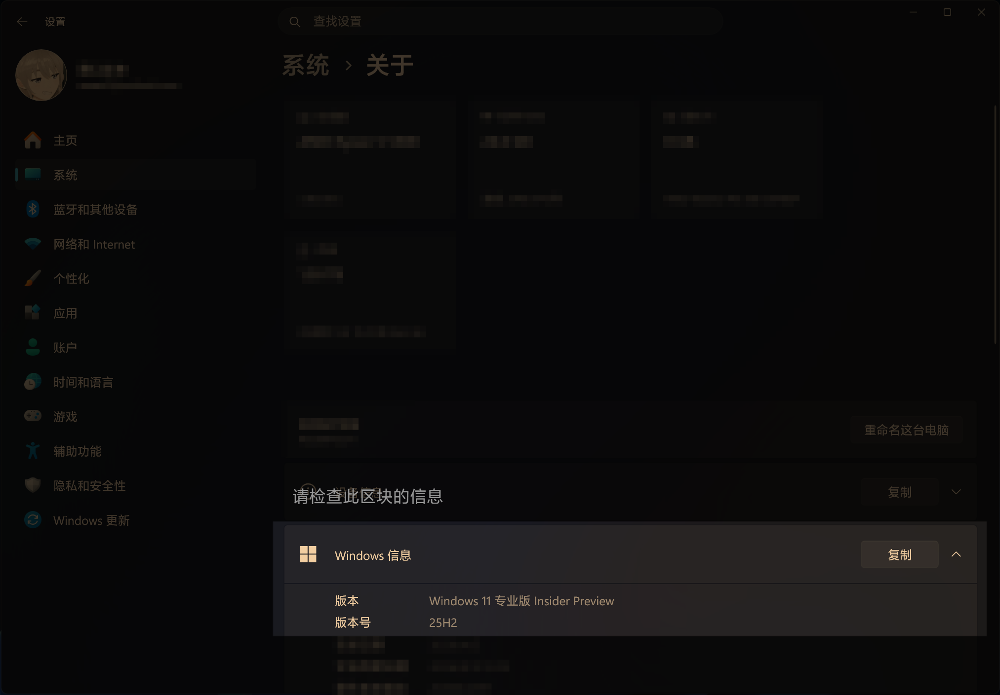

# 下载与安装
::: info
本页存在“Kazuha”字样的插图，请不必担心。
彼时，荧素万演的名称为“Kazuha”。
:::

此页将引导您下载并安装荧素万演。

## 检查操作系统配置
::: warning
如欲在您的设备上运行荧素万演，您必须检查自己的设备配置是否符合要求。
:::

**如您使用 Windows 操作系统，请在系统设置中检查自己的系统版本是否为 Windows 10/11。**
- 方法：鼠标右击”任务栏“ -> 任务栏设置 -> 系统 -> 向下滚动至“关于” -> 察看“Windows 信息”板块。

*如图是此页面的示例。*

## 下载

1. 打开 [荧素万演发布页](https://github.com/Haraguse/Kazuha/releases)，访问不了可通过[思拓创联组织存储库](https://stk.sectl.top/)下载。

   

2. 在最新版本中找到安装包，点击下载。

   

3. 下载完成后，安装包会出现在“下载”文件夹。  
   为避免文件混乱，建议将其解压到独立文件夹。

   

   ::: warning
   如果连“解压”都不熟悉，请先学习相关基础操作，再继续阅读。
   :::

## 安装与启动

1. 解压后，双击 `Luminalium.exe` 启动程序。  
   正常情况会看到如下启动界面：

   

2. 如需个性化设置，右键任务栏右下角的托盘图标即可。
